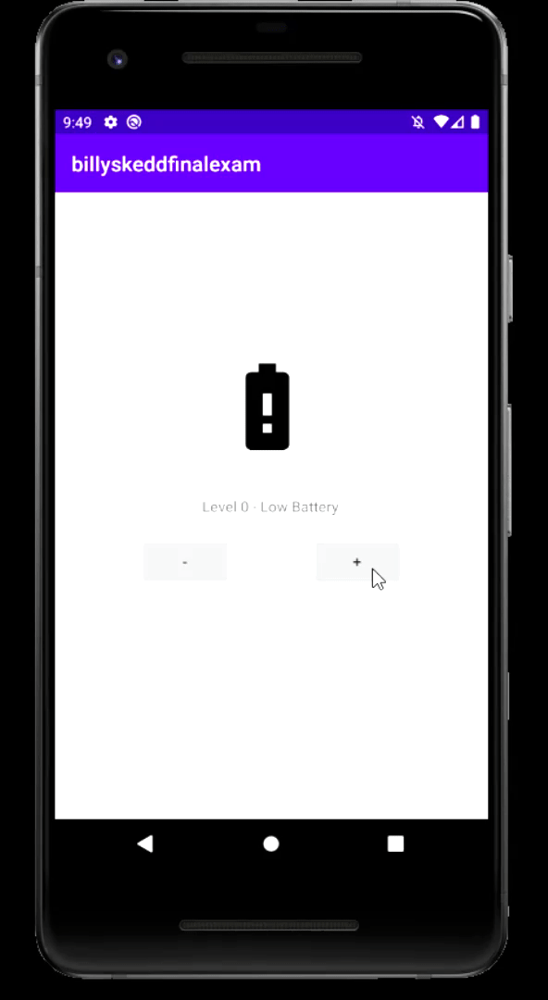

# billyskeddfinalexam
CS 260 Final Exam

Final Exam Github Repository for CS260.

Use the battery icons from the Vector Asset Studio to represent 7 different values for the battery level.

The app should have the following properties:

The plus button increments the level, causing the battery indicator to appear more full.
The minus button decrements the level, causing the indicator to empty one level.

